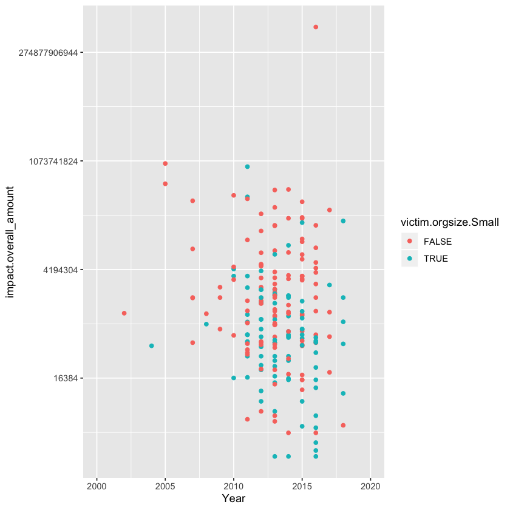

```R
#lets load our necesasry libraries, I've already downloaded the verisr from the VZ-Risk repo
library(ggplot2)
library(verisr)
library(dplyr)

data('industry2',package='verisr')
```


```R
#Awesome, now I have the tools I need for the job, so I will proceed to roll on with loading the data,
# I'm using he fix that was recommended here to load the data: ttps://github.com/vz-risk/verisr/pull/15


ver <- json2veris(dir = "~/Desktop/VCDB-master/data/json/validated", schema = "~/Desktop/veris-master/verisc-merged.json")

```

    Warning message in `[.data.table`(veris, , `:=`((grep("event_chain[.]", names(veris), :
    “length(LHS)==0; no columns to delete or assign RHS to.”

    [1] "veris dimensions"
    [1] 8198 2297
    named integer(0)
    named integer(0)


```R
#I'll just do some quick checks to make sure everything is looking good data wise

dim(ver)
summary(ver)


```


<ol class=list-inline>
	<li>8198</li>
	<li>2297</li>
</ol>


    8198 incidents in this object.


          actor                action            asset                attribute   
     External:4168   Environmental:   8   Embedded  :   2   Availability   :2422  
     Internal:3719   Error        :2374   Kiosk/Term: 345   Confidentiality:7577  
     Partner : 359   Hacking      :2185   Media     :2207   Integrity      :1975  
     Unknown : 223   Malware      : 678   Network   : 157                         
                     Misuse       :1675   Person    : 606                         
                     Physical     :1565   Server    :3819                         
                     Social       : 554   Unknown   : 646                         
                     Unknown      : 237   User Dev  :1478                         
                                                                                  


```R
#Actors are cool, but I'm interested to see if there's any difference between the organizations of different sizes
# and the risks they face. I'll use the victim.orgsize object to help me out with my analysis


getenum(ver, c('victim.orgsize'))
```


<table>
<thead><tr><th scope=col>enum</th><th scope=col>x</th><th scope=col>n</th><th scope=col>freq</th></tr></thead>
<tbody>
	<tr><td>Large  </td><td>3083   </td><td>5481   </td><td>0.56249</td></tr>
	<tr><td>Small  </td><td>2398   </td><td>5481   </td><td>0.43751</td></tr>
</tbody>
</table>


```R
#Lets see how this changes over time using the example from the documentation (I filter out the uknown sized orgs)

ver %>%
filter(!victim.employee_count.Unknown) %>%
dplyr::group_by(victim.orgsize.Small)%>%
dplyr::count(timeline.incident.year) %>%
dplyr::ungroup() %>%
dplyr::rename(size = victim.orgsize.Small)%>%
dplyr::mutate(size = ifelse(size, "Small","Large")) %>%
ggplot2::ggplot()+
ggplot2::geom_bar(ggplot2::aes(x=timeline.incident.year, y=n, group=size, fill=size), stat="identity")+
ggplot2::labs(title="VCDB ORG Size by Incident Year", x="Count", y="Year") +
ggplot2::scale_x_continuous(expand=c(0,0), limits=c(2003, 2019)) +
ggplot2::scale_y_continuous(expand=c(0,0)) +
ggplot2::scale_fill_brewer() +
ggplot2::theme_minimal() +
ggplot2::theme(
    panel.grid.major.x = ggplot2::element_blank(),
    panel.grid.minor.x = ggplot2::element_blank(),
    panel.grid.minor.y = ggplot2::element_blank()
    )


```

    Warning message:
    “Removed 8 rows containing missing values (position_stack).”Warning message:
    “Removed 3 rows containing missing values (geom_bar).”


```R
#lets check to see if there's a difference between the impact sizes and orgsizes 

ver.orgsize <- 
    ver%>%
    filter(!ver$victim.employee_count.Unknown)
boxplot(ver.orgsize$impact.overall_amount~ver.orgsize$victim.orgsize.Small, log='y', ylab="Impact Overall Amount (Log)", xlab = "Small Org Size")

```


```R
#Let a quick view of the differences over time (nothing that we can really tell from this)

ggplot(ver.orgsize, aes(x=timeline.incident.year, y=impact.overall_amount, color=victim.orgsize.Small)) + 
geom_point()+
scale_y_continuous(trans='log2')+
scale_x_continuous(name="Year", limits=c(2000, 2020))
```

    Warning message:
    “Removed 5266 rows containing missing values (geom_point).”





```R
# Lets see if there's interesting breakdowns in terms of the distribution of impact between Large + Orgs over the different years
# by using some boxplots and grouping them by year. Nothing conclusive, but it is interesting to  see
# difference (atleast in terms of overall_amount) between small and large organizations. As a next step, we could
# look at things like ratios between # of incidents + impacts_overall, which could help us better understand 
# if organizations are simply being hit more often (which ratio wise they are) or if the impact_overall is increasing
ggplot(ver.orgsize, aes(x= victim.orgsize.Small, y=impact.overall_amount))+
scale_x_discrete()+
scale_y_log10()+
geom_boxplot()+
facet_wrap(~timeline.incident.year, scale="free")


```

    Warning message:
    “Removed 5266 rows containing non-finite values (stat_boxplot).”


